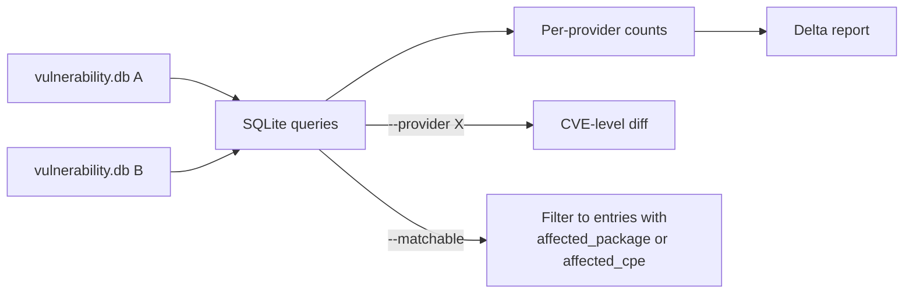

# 🔬 smelt

**Know exactly what's different between two grype vulnerability databases.**

smelt opens two `vulnerability.db` files and tells you what changed — which providers were added or removed, how many entries shifted per provider, and which specific CVEs differ. Add `--matchable` to filter out empty stubs and see only the entries grype can actually match against.

## Install

```bash
go install github.com/agentic-research/smelt/cmd/smelt@latest
```

## Usage

### Compare two databases

```bash
smelt diff a.db b.db
```

```
PROVIDER                             DB-A       DB-B      DELTA
--------------------------------------------------------------
github                              48851      48844         -7
nvd                                337953     337953          0
alpine (added)                          -       8572      +8572
debian (added)                          -     106554    +106554
--------------------------------------------------------------
TOTAL                              402595     756911    +354316
```

### Drill into a specific provider

```bash
smelt diff a.db b.db --provider github
```

```
Provider: github
Common: 48844  |  Only in A: 7  |  Only in B: 0

Only in DB-A:
  - GHSA-3q53-ww3h-grwr
  - GHSA-5g36-7rfc-494g
  ...
```

### Filter to effective coverage

Many NVD entries are stubs with no CPE or package match data — grype can't match against them. Use `--matchable` to see only what matters:

```bash
smelt diff a.db b.db --matchable
```

This filters to entries with at least one `affected_package_handle` or `affected_cpe_handle`.

### Compare state graphs

If both databases have an associated [mache](https://github.com/agentic-research/mache) state graph:

```bash
smelt diff a.db b.db --state-a a-state.db --state-b b-state.db
```

## How it works



smelt reads the grype-db v6 schema directly (`providers`, `vulnerability_handles`, `affected_package_handles`, `affected_cpe_handles`). Falls back to v5 namespace queries for older databases.

## Flags

| Flag | Description |
|------|-------------|
| `--provider` | Drill into CVE-level diff for one provider |
| `--matchable` | Only count entries grype can match (has package/CPE data) |
| `--state-a`, `--state-b` | Paths to mache state.db files for graph comparison |

## License

[Apache-2.0](LICENSE)
