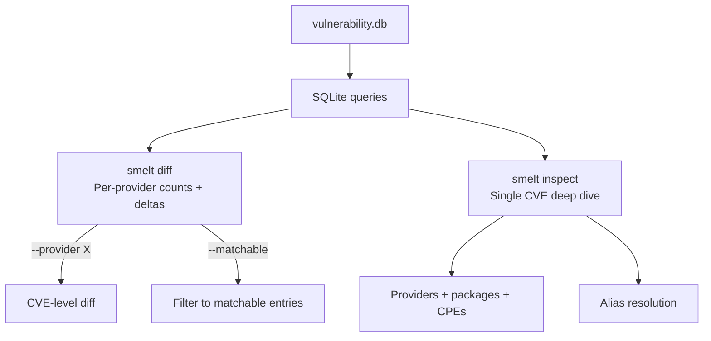

# smelt

**Know exactly what's different between two grype vulnerability databases.**

## Table of Contents

- [Install](#install)
- [Commands](#commands)
  - [diff — Compare two databases](#diff--compare-two-databases)
  - [inspect — Debug a single CVE](#inspect--debug-a-single-cve)
- [How it works](#how-it-works)
- [Reference](#reference)
- [License](#license)

## Install

```bash
go install github.com/agentic-research/smelt/cmd/smelt@latest
```

## Commands

### diff — Compare two databases

Compare provider coverage and row counts between any two grype vulnerability databases:

```bash
smelt diff db-a.db db-b.db
```

```
PROVIDER                             DB-A       DB-B      DELTA
--------------------------------------------------------------
epss                               320636     320636          0
github                              48851      48844         -7
kev                                  1542       1542          0
nvd                                337953     337953          0
alpine (B only)                         -       8572      +8572
debian (B only)                         -     106554    +106554
rhel (B only)                           -      24762     +24762
ubuntu (B only)                         -      56146     +56146
--------------------------------------------------------------
TOTAL                              724773    1079089    +354316
```

#### Drill into a provider

See exactly which CVEs differ for a specific provider:

```bash
smelt diff db-a.db db-b.db --provider github
```

```
Provider: github
Common: 48844  |  Only in A: 7  |  Only in B: 0

Only in DB-A:
  - GHSA-3q53-ww3h-grwr
  - GHSA-5g36-7rfc-494g
  - GHSA-5mcx-ff2q-gjjf
```

#### Filter to effective coverage

Many NVD entries are stubs — no CPE or package match data, so grype can't match against them. Use `--matchable` to see only entries grype can actually use:

```bash
smelt diff db-a.db db-b.db --matchable
```

```
PROVIDER                             DB-A       DB-B      DELTA
--------------------------------------------------------------
nvd                                295426     295426          0
...
--------------------------------------------------------------
TOTAL                              360028     687556    +327528
```

42,527 NVD entries filtered out (stubs with no CPE data).

### inspect — Debug a single CVE

Show everything a database knows about a specific CVE — which providers have it, whether it's matchable, what packages and CPEs are covered:

```bash
smelt inspect vulnerability.db CVE-2024-3094
```

```
CVE:       CVE-2024-3094
DB Built:  2026-03-18T19:06:09Z
Schema:    6.1.4
Aliases:   GHSA-rxc8-2hfw-w2f5
Providers: 4

[~] debian  status=active  pkg=3  cpe=0
      pkg: xz-utils [deb] (debian:12)  fixed @ 5.6.1+really5.4.5-1 (< 5.6.1+really5.4.5-1)
      pkg: xz-utils [deb] (debian:13)  fixed @ 5.6.1+really5.4.5-1 (< 5.6.1+really5.4.5-1)
      pkg: xz-utils [deb] (debian:)  fixed @ 5.6.1+really5.4.5-1 (< 5.6.1+really5.4.5-1)
[~] nvd  status=analyzed  pkg=0  cpe=1
      cpe: tukaani:xz  fixed @ 5.6.2 (>= 5.6.0, < 5.6.2)
[~] ubuntu  status=active  pkg=3  cpe=0
      pkg: xz-utils [deb] (ubuntu:22)  fixed @ 5.2.5-2ubuntu1.1
      pkg: xz-utils [deb] (ubuntu:24)  fixed @ 5.6.1+really5.4.5-1
      pkg: xz-utils [deb] (ubuntu:25)  fixed @ 5.6.1+really5.4.5-1ubuntu0.1
```

`[~]` = matchable (grype can detect it), `[x]` = stub (entry exists but no match data).

Shows fix state, fix version, and version constraints from the database blobs.

#### Compare the same CVE across two databases

```bash
smelt inspect db-a.db db-b.db CVE-2024-3094
```

```
CVE: CVE-2024-3094

=== DB-A ===
  DB Built:  2026-03-18T19:06:09Z
  Providers: 1
  Matchable: 1/1
  Packages:  0
  CPEs:      1

  [~] nvd  status=analyzed  pkg=0  cpe=1

=== DB-B ===
  DB Built:  2026-03-18T06:34:50Z
  Providers: 4
  Matchable: 4/4
  Packages:  6
  CPEs:      1

  [~] debian  status=active  pkg=3  cpe=0
  [~] nvd  status=analyzed  pkg=0  cpe=1
  [~] ubuntu  status=active  pkg=3  cpe=0
```

#### Resolve GHSA IDs

```bash
smelt inspect vulnerability.db GHSA-rxc8-2hfw-w2f5
```

Resolves the alias to `CVE-2024-3094` and shows the same result.

#### JSON output

```bash
smelt inspect --json vulnerability.db CVE-2024-3094
smelt diff --json db-a.db db-b.db
```

All commands support `--json` for CI pipelines.

## Parity scoring

`smelt diff` computes a [Dice coefficient](https://en.wikipedia.org/wiki/S%C3%B8rensen%E2%80%93Dice_coefficient) over common providers to measure how similar two databases are:

```
Dice = 2 × |A ∩ B| / (|A| + |B|)
```

For each provider present in both databases, the overlap is `min(count_a, count_b)`. The coefficient ranges from 0% (no overlap) to 100% (identical). It penalizes both missing and extra entries symmetrically, and handles databases of different sizes without being misleading.

Use `--matchable` for meaningful parity scores — without it, NVD stubs (entries with no CPE/package data that grype can't match against) inflate the counts.

Archives (`.tar.gz`, `.tar.zst`, `.tar.xz`) are supported as inputs — the first `.db` file inside is extracted automatically.

## How it works



smelt reads the grype-db v6 schema directly (`providers`, `vulnerability_handles`, `affected_package_handles`, `affected_cpe_handles`, `vulnerability_aliases`). Falls back to v5 namespace queries for older databases. Enrichment providers (EPSS, KEV) are counted from their own tables.

## Reference

| Command | Description |
|---------|-------------|
| `smelt diff <a> <b>` | Compare two databases |
| `smelt diff --provider X` | CVE-level diff for one provider |
| `smelt diff --matchable` | Only count entries with package/CPE data |
| `smelt diff --state-a --state-b` | Compare mache state graphs |
| `smelt inspect <db> <cve>` | Show all data for a CVE or GHSA |
| `smelt inspect <a> <b> <cve>` | Compare the same CVE across two databases |
| `--json` | JSON output (works with diff and inspect) |
| `smelt version` | Print version |

## License

[Apache-2.0](LICENSE)
